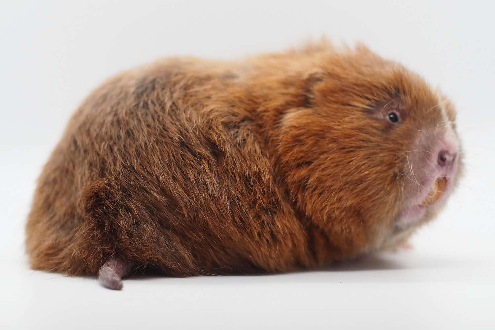
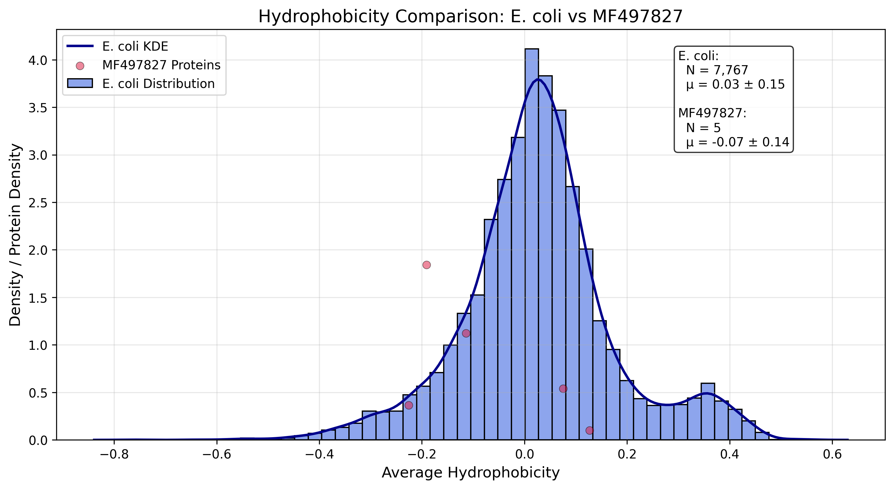
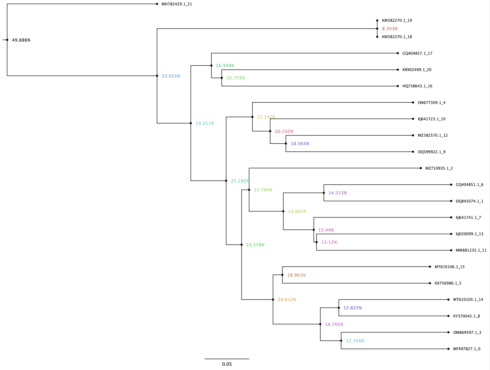

# Introduction


Figure 1

- **Viral classification:**  
  *ICTV classification*:
Realm: Monodnaviria
Kingdom: Shotokuvirae
Phylum: Cressdnaviricota
Class: Arfiviricetes
Order: Cirlivirales
Family: Circoviridae
Genus: Circovirus
Species: Circovirus gryzon  
  - *Baltimore classification*: Class 2, single stranded DNA virus. [5]

- **Physical size:**  
  - There was no physical size in nanometers that I was able to find online, however it was 2112 base pairs and most other circoviruses are 15 to 25 nanometers long which compared to the human cell which is much smaller and covid is roughly 50 to 140 nm which makes it smaller as well [1],[3].

- **Shape and envelope:**  
  - The virus is circular in shape and has no envelope like most Circoviruses.[6]

- **Discovery and outbreaks:**  
  - The virus was discovered in 2014 in Fujian, China and has been found all over the Guangdong Province in China. There is no news on recent outbreaks. [1]

- **Host range:**  
  - Bamboo rat circovirus was found in a bamboo rat and there is no evidence that it has infected any other species, however circoviruses are known to infect many kinds of vertebrates. Many new circoviruses have been identified in recent years and they have become a large threat with farmed animals.[6],[2]

- **Cell entry:**  
  - Circoviruses penetrate the cell by binding to the hosts receptors and then perform receptor mediated endocytosis to get inside the cell. Once inside it replicates in the nucleus.

- **Replication strategy:**  
  - The virus replicates using a rolling-circle mechanism. [5]

- **Release mechanism:**  
  - If this virus follows other circoviruses, it likely uses the cell lysis release mechanism [4].

- **Latency:**  
  - There is no latency in the host cells and like most circoviruses, it replicates actively. 

- **Equilibrium and antigenic shift:**  
  - Bamboo rat Circoviruses is not at an equilibrium with humans and only affects bamboo rats and other rodents. An antigenic shift is not likely to happen as the virus has a low mutation rate. 

- **Vaccines:**  
  - As of now there are no vaccines created to counteract bamboo rat circovirus. 

- **Antiviral drugs:**  
  - There is no information on any antiviral drugs that have been created.
-----------------------------------------------------------------------------------------------------------------------------------
# Methods

1. The first thing I did was find all of the accession codes that I will need and put all of them in a dictionary: 

```python
accession_codes = {
    "BRCV": "MF497827","GuCV": "DQ845074", "GyurCV": "MZ710935", "DipV_4537": "OM869597", "HumCV1": "ON677309",
    "BatACV10": "KX756986", "ChimpACV": "GQ404851", "BatCV-9": "KJ641741", "RoACV2": "KY370042",
    "BanFV1": "OQ599922", "BatACV7": "KJ641723", "EquCV": "MW881235", "MonCV1": "MZ382570",
    "MiCV": "KJ020099", "SonfelCV1": "MT610105", "SonfelCV2": "MT610106",
    "ChickACyV1": "HQ738643", "GoACyV1": "GQ404857", "HuACyV4": "KM382270",
    "BatACyV10": "KM382270", "HoACyV1": "KR902499",
    "BovNa": "MH782429"
}
```
This included the bamboo rat circovirus as well as 15 other circoviruses, 5 cycloviruses, and 1 virus that was different enough to be an outgroup.

2. Next I made sure to download a MF497827.fasta file using modified code from lab 9:
```python
from Bio import Entrez
Entrez.email = "jfink15@charlotte.edu"
handle = Entrez.efetch(db="nucleotide", id="MF497827", rettype="fasta", retmode="text")
record = handle.read()
handle.close()
with open("MF497827.fasta", "w") as f:
    f.write(record)
```


3. Using the new fasta file of my virus I then used more lab 9 code that I changed to fit my virus in order to find all the orfs in my virus and put them in a file for easy access.
```python
from Bio import SeqIO
from Bio.Seq import Seq
from Bio.SeqUtils import nt_search
# Load your FASTA file
file_path = "MF497827.fasta" # Replace with your virus fasta file
record = SeqIO.read(file_path, "fasta")
sequence = record.seq
# Function to find open reading frames (ORFs)
def find_orfs(sequence, min_length=300):
    orfs = []
    for frame in range(3): # Check in all 3 frames
        translated = sequence[frame:].translate() # Translate our sequence to proteins
        start = None
        for i in range(len(translated)):
            if translated[i] == 'M' and start is None: # Start codon
                start = i
            elif translated[i] == '*' and start is not None: # Stop codon
                if i - start >= min_length: # Check if ORF is longer than 300 bp
                    orfs.append(sequence[frame + start*3 : frame + i*3])
                start = None
    return orfs
# Find ORFs longer than 300 bp
orfs = find_orfs(sequence, min_length=300)
# Print ORFs (if any)
print(f"Found {len(orfs)} ORFs longer than 300 bp.")
for idx, orf in enumerate(orfs, 1):
    print(f"ORF {idx}: Length {len(orf)} bp")
# Optionally, save the ORFs to a new FASTA file
with open("MF497827_ORFs.fasta", "w") as output_file:
    for idx, orf in enumerate(orfs, 1):
        output_file.write(f">ORF_{idx}\n")
        output_file.write(f"{orf}\n")
print("ORFs saved to MF497827_ORFs.fasta")

```

4. Next I needed to translate the orf into a proteins and save them in a new file called MF497827_proteome.fasta. I used modified code from Vedika's script seen below:
```python
from Bio import SeqIO

# Load the ORFs FASTA file
orfs = list(SeqIO.parse("MF497827_ORFs.fasta", "fasta"))
# Translate nucleotide sequences to protein sequences
proteins = []
for orf in orfs:
    protein_seq = orf.seq.translate(to_stop=True)
    proteins.append(protein_seq)

# Save translated proteins to FASTA
with open("MF497827_proteome.fasta", "w") as out_file:
    for idx, prot in enumerate(proteins, 1):
        out_file.write(f">Protein_{idx}\n")
        out_file.write(str(prot) + "\n")

# This print is outside the with block
print(f"{len(proteins)} proteins saved to MF497827_proteome.fasta")
```
5. My next goal was to plot the hydrophobicity charts, and compare the calculated hydrophobicity of my virus and compare it to the E.coli genome that we used from lab_9. To do this I copied functions and loaded the e.coli_genome.gb into my working directory. I also used pandas to make the tables and then plotted the two against each other as seen below in Figure 2.
```python
from my_helpers import find_all_orfs
orfs = find_all_orfs("MF497827.fasta")
long_orfs = [orf for orf in orfs if orf['length'] >= 300]


email = "jfink15@charlotte.edu"
fasta_sequences = fetch_coronavirus_fasta(accession_codes, email)

# Save all sequences to a combined FASTA file


MF497827_data = calculate_hydrophobicities("MF497827_proteome.fasta", hydro_table)

import pandas as pd
df = pd.DataFrame(MF497827_data)
print(df[['sequence_id', 'start', 'end', 'average_hydrophobicity']].head())

from my_helpers import find_all_orfs
orfs = find_all_orfs("ecoli_genome.gb")
long_orfs = [orf for orf in orfs if orf['length'] >= 300]

export_trimmed_proteins(long_orfs, "ecoli_genome.gb")
ecoli_data = calculate_hydrophobicities("ecoli_genome.gb", hydro_table)

# Convert to pandas DataFrame for analysis
import pandas as pd
df = pd.DataFrame(ecoli_data)
print(df[['sequence_id', 'start', 'end', 'average_hydrophobicity']].head())

plot_hydrophobicity_comparison(
    ecoli_data,
    MF497827_data,
    ecoli_label="E. coli",
    other_label="MF497827",
    save_path="hydrophobicityNEWVIRUScomparison.png"
)

```

6. Now after plotting the hydrophobicities, I just needed to do one more plot from lab 9 which was to compare the size of my genome to a random selection of other viruses. To do this I went to NCBI and followed the instructions to randomly sample viruses and then copied the .csv onto my working directory. I also copied the viral_genome_histogram.py script onto my directory which I then edited to include my Bamboo Rat Circovirus. The result of this can be seen in Figure 3 below.
```bash
cp /projects/class/binf3101_001/viral_genome_histogram.py ~/final

nano viral_genome_histogram.py
python viral_genome_histogram.py
```
7. My next goal was to use FigTree and make a phylogenetic tree using the accession codes from earlier. To do this I mostly just copied and pasted lab 10 functions and Vedika's script.


```python

accession_codes = {
    "BRCV": "MF497827","GuCV": "DQ845074", "GyurCV": "MZ710935", "DipV_4537": "OM869597", "HumCV1": "ON677309",
    "BatACV10": "KX756986", "ChimpACV": "GQ404851", "BatCV-9": "KJ641741", "RoACV2": "KY370042",
    "BanFV1": "OQ599922", "BatACV7": "KJ641723", "EquCV": "MW881235", "MonCV1": "MZ382570",
    "MiCV": "KJ020099", "SonfelCV1": "MT610105", "SonfelCV2": "MT610106",
    "ChickACyV1": "HQ738643", "GoACyV1": "GQ404857", "HuACyV4": "KM382270",
    "BatACyV10": "KM382270", "HoACyV1": "KR902499",
    "BovNa": "MH782429"
}
from Bio import Entrez
import time

def fetch_coronavirus_fasta(accession_codes, email="your.email@example.com"):
    """
    Fetch FASTA sequences from Entrez using given accession codes.
    
    Args:
        accession_codes (dict): Dictionary of {name: accession_number}
        email (str): Valid email for NCBI API usage
    
    Returns:
        dict: {name: fasta_string} dictionary containing FASTA-formatted sequences
    """
    Entrez.email = email
    sequences = {}
    
    for name, accession in accession_codes.items():
        try:
            with Entrez.efetch(
                db="nucleotide",
                id=accession,
                rettype="fasta",
                retmode="text"
            ) as handle:
                fasta_data = handle.read().strip()
                sequences[name] = fasta_data
                print(f"Retrieved {name} ({accession})")
                time.sleep(0.35)  # NCBI recommends <3 requests/sec
            
        except Exception as e:
            print(f"Error retrieving {name} ({accession}): {str(e)}")
            sequences[name] = None  # Store None for failed retrievals
    
    return sequences

fasta_sequences = fetch_coronavirus_fasta(accession_codes, email)

# Save all sequences to a combined FASTA file
with open("coronavirus_sequences.fasta", "w") as f:
    for name, fasta in fasta_sequences.items():
        if fasta:
            f.write(fasta + "\n\n")

# Access individual FASTA string
print(fasta_sequences["Human-SARS"][:200])  # Show first 200 characters

from Bio import Entrez
from Bio import SeqIO
from io import StringIO
import time

def calculate_sequence_lengths(sequences, accession_codes):
    print("\n{:40} | {:15} | {}".format("Virus Name", "Accession", "Sequence Length"))
    print("-" * 70)
    
    for name, accession in accession_codes.items():
        fasta = sequences.get(name)
        if not fasta:
            print(f"{name[:40]:40} | {accession:15} | {'Retrieval failed':15}")
            continue
            
        try:
            record = SeqIO.read(StringIO(fasta), "fasta")
            print(f"{name[:40]:40} | {accession:15} | {len(record.seq):,} bp")
        except Exception as e:
            print(f"{name[:40]:40} | {accession:15} | {'Invalid format':15}")

calculate_sequence_lengths(fasta_sequences, accession_codes)
```
I then used mafft script in order to align the file as all sequences need to be the same length in order to create a tree.
```bash
module load mafft
mafft --auto sequences.fasta > all_sequences_aligned.fasta

```
Now to create the tree:
```python
from Bio import Phylo
from Bio.Phylo.TreeConstruction import DistanceCalculator
from Bio.Phylo.TreeConstruction import DistanceTreeConstructor
from Bio import AlignIO

seq_alt=AlignIO.read("all_sequences_aligned.fasta", "fasta")

calculator = DistanceCalculator('identity')
dm = calculator.get_distance(seq_alt)
constructor = DistanceTreeConstructor()
tree = constructor.upgma(dm)
Phylo.draw_ascii(tree)

```
This made a ascii tree in terminal but not in FigTree. I was stuck on this for a little bit as I forgot how to get the tree on FigTree, but I was eventually able to figure it out by looking at Vedika's script. This saved the tree I made into the newick file format that I was able to use and create a tree out of, see Figure 4.

```python
Phylo.write(tree, "virus_tree.nwk", "newick")
```
-----------------------------------------------------------------------------------------------------------------------------------
# Results and Discussion


**Hydrophobicity Plot**


Figure 2

In this image we plot the hydrophobicity of the bamboo circovirus against an E.coli proteome. We can see that the hydrophobicity sits roughly around 0 and is fairly similar to the E.coli, however we only have 5 points plotted of the circovirus versus the 7,767 plotted for the E.coli meaning ours is a less accurate measure.

-----------------------------------------------------------------------------------------------------------------------------------
I struggled a decent bit with this portion, but eventually ended up blasting one of the proteins. There wasn't really any true outliers as there were only 5 data points to work off of. After blasting MF497827.1_ORF1, I found it was related to replication and likely is very imporant on how the virus functions and reproduces. 

-----------------------------------------------------------------------------------------------------------------------------------
**Bamboo Circovirus Compared to other Viruses:**


Figure 3

The Bamboo Circovirus falls roughly in the middle of the pack when compared to other viruses based on its genome size of 2112bp. 

-----------------------------------------------------------------------------------------------------------------------------------

**Phylogeny Tree**


Figure 4

For my tree I used the L-INS-i model to best fit my data. It stands for local pairwise alignment, iterative refinement, incorporating structural information. In MAFFT, it is one of the more accurate models, but the downside is how slow it is and computationally intensive. We can see our virus with its accession code: MF497827. Our outgroup is the MH782429.1 (Bovdisa virus) rooted at the top. Its three closest relatives are the dipodfec virus, rodent circovirus, and sonfela circovirus 1. There is no evidence of a host switch and the bootstrap values are not good at all.

-----------------------------------------------------------------------------------------------------------------------------------

# References Cited
[1] Wu, J., and J. Jiang. “Bamboo Rat Circovirus Isolate FJ01, Complete Genome - Nucleotide - NCBI.” National Center for Biotechnology Information, U.S. National Library of Medicine, www.ncbi.nlm.nih.gov/nuccore/MF497827. Accessed 6 May 2025. 

[2] Poor, Allison. “Rhizomyinae (Bamboo Rats and Mole Rats).” Animal Diversity Web, animaldiversity.org/accounts/Rhizomyinae/. Accessed 6 May 2025. 

[3] Gomez-Betancur, Diana, et al. “Canine Circovirus: An Emerging or an Endemic Undiagnosed Enteritis Virus?” Frontiers in Veterinary Science, U.S. National Library of Medicine, 17 Apr. 2023, pmc.ncbi.nlm.nih.gov/articles/PMC10150634/. 

[4] “Genus: Circovirus.” ICTV, ictv.global/report/chapter/circoviridae/circoviridae/circovirus. Accessed 6 May 2025. 

[5] Dr. Catherine Shaffer, Ph.D. “The Baltimore Classification System.” News, 26 Feb. 2019, www.news-medical.net/life-sciences/The-Baltimore-Classification-System.aspx. 

[6] Ren, Zhaowen, et al. “The Genetic Diversity and Interspecific Transmission of Circovirus in Rhizomys Sinensis in Guangdong, Southern China.” Transboundary and Emerging Diseases, U.S. National Library of Medicine, 9 Nov. 2023, pmc.ncbi.nlm.nih.gov/articles/PMC12017068/. 
